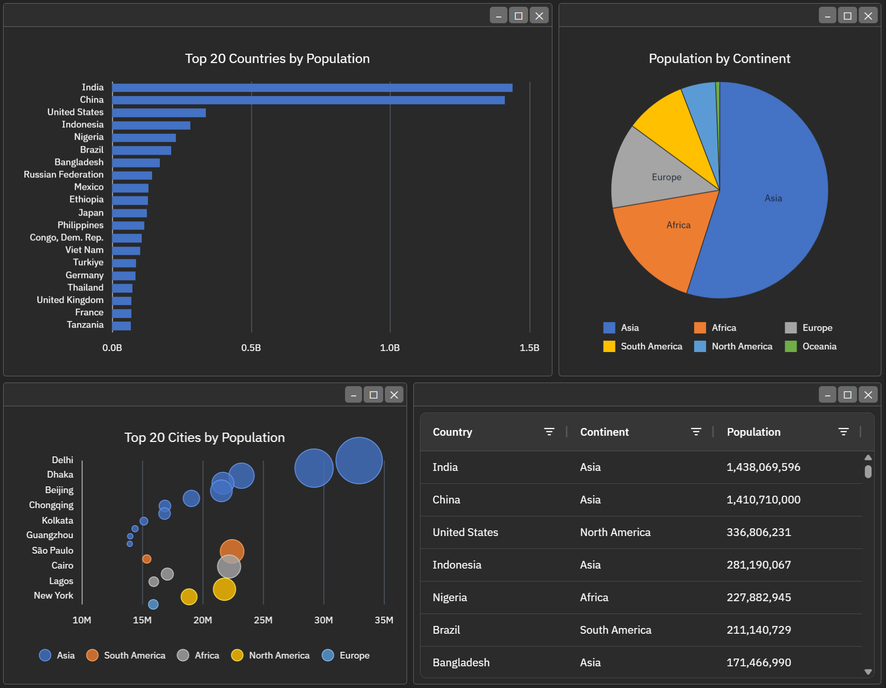

## React Binary Window

[](https://github.com/bhjsdev/react-bwin/actions/workflows/publish.yml)
[](https://www.npmjs.com/package/react-bwin)

A React tiling window manager featuring resizable panes, drag-and-drop, and more. Built on top of the [Binary Window](https://github.com/bhjsdev/bwin) library.

[](https://bhjsdev.github.io/bwin-docs?theme=dark)

### Why react-bwin

Resizing and dragging stay smooth even with heavy content in every pane. react-bwin renders the layout DOM once, then lets the underlying [bwin](https://github.com/bhjsdev/bwin) engine drive interactions with direct DOM writes — so there's **no virtual-DOM diff on the drag path**. Your pane content stays normal React.

### Install

```bash
npm install react-bwin
```

### Documentation

Full guides, API reference, and live examples: [bhjsdev.github.io/bwin-docs](https://bhjsdev.github.io/bwin-docs/react/get-started)

### Contributing

See [CONTRIBUTING.md](CONTRIBUTING.md) for local development and how to run the examples.

### Related

- [bwin](https://github.com/bhjsdev/bwin) — the underlying window-tiling engine this binds to.
